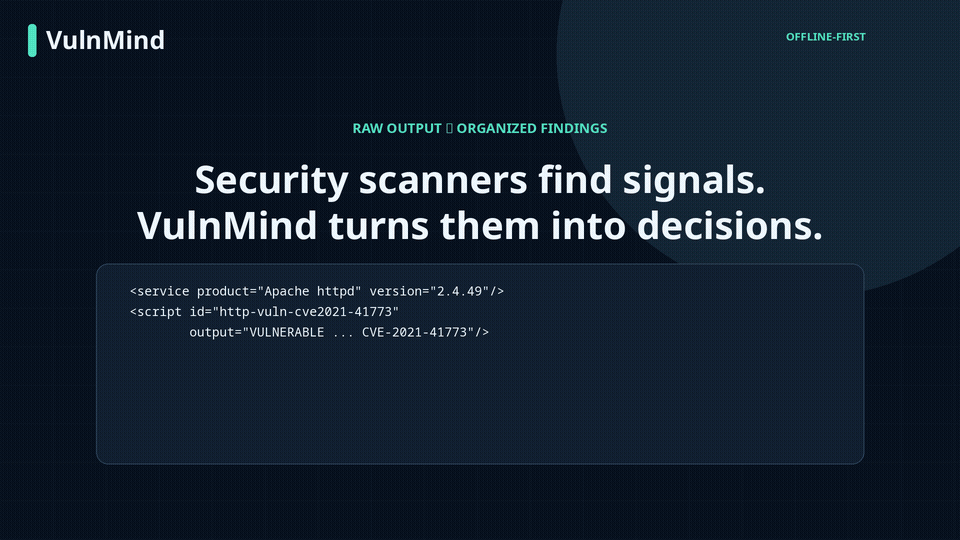
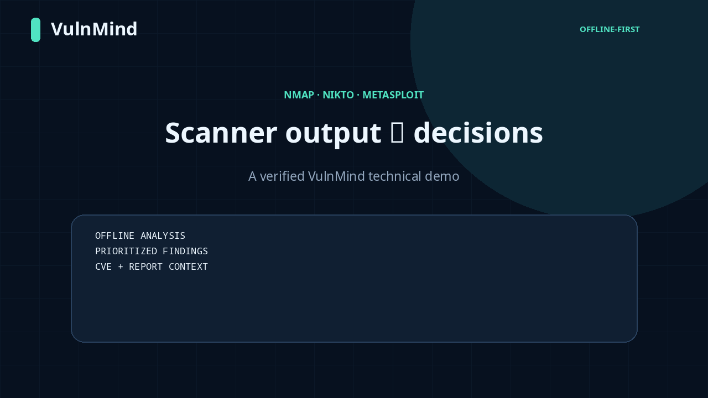
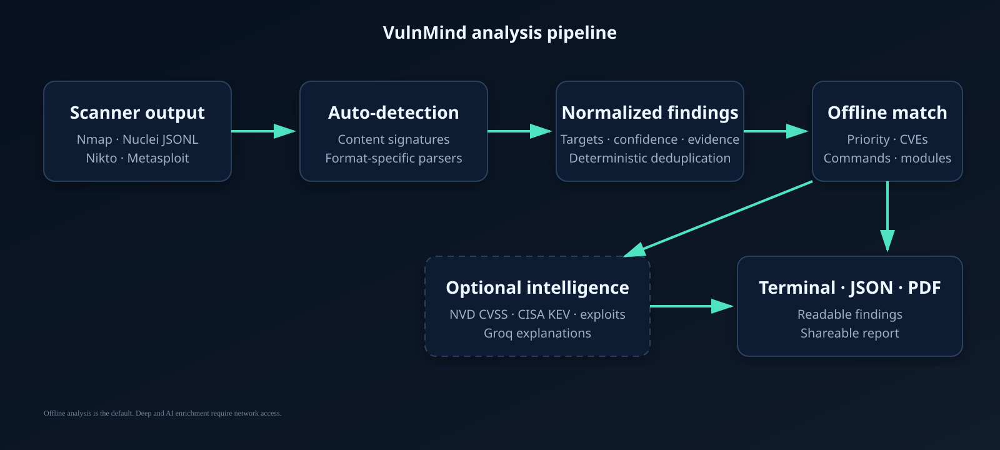
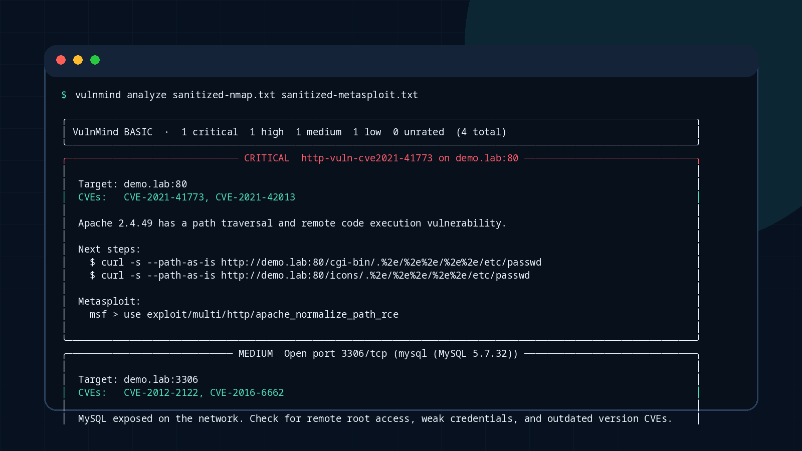
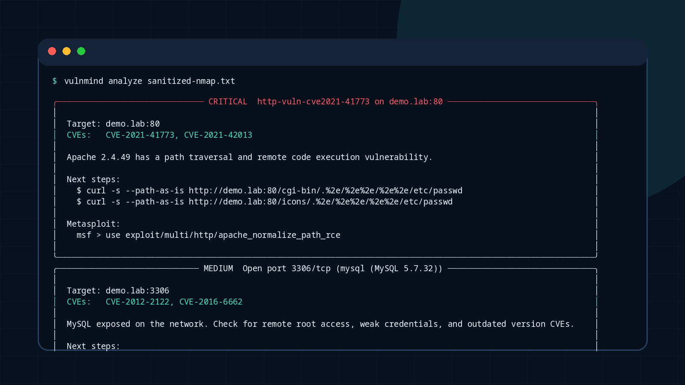
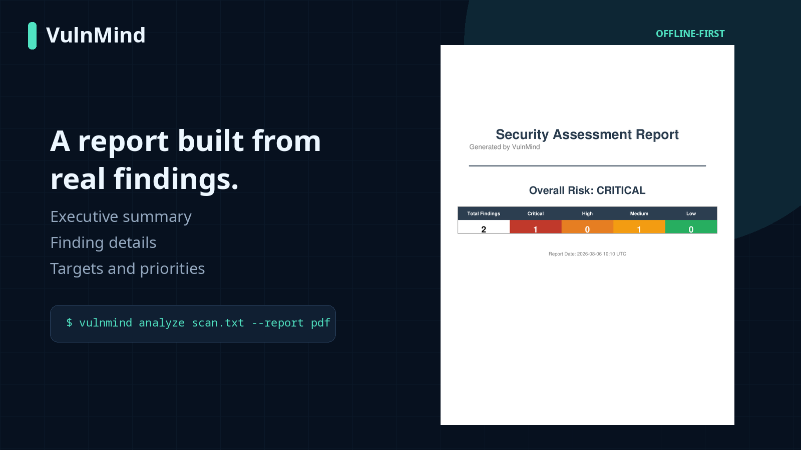

# VulnMind


VulnMind turns supported scanner-output files into normalized, prioritized
findings with offline CVE context, suggested verification commands, and
relevant Metasploit modules.



## What it does

- Auto-detects Nmap XML/text, Nikto text, and Metasploit console output.
- Normalizes and deduplicates findings across multiple files.
- Matches product/version evidence against an offline knowledge base.
- Produces readable terminal findings and PDF reports.

## Quick start

Requires Python 3.10+.

```bash
pip install vulnmind
vulnmind analyze scan.xml
```

Or install from source:

```bash
git clone https://github.com/Sombra-1/vulnmind
cd vulnmind
python -m venv .venv
. .venv/bin/activate
pip install -e .
```

Run one or more saved scanner-output files:

```bash
vulnmind analyze scan.xml nikto.txt
```



The full-resolution technical demo is kept out of normal Git history. See the
[reproducible demo package](tools/demo/README.md) to render and verify it
locally.

## How it works



VulnMind reads saved scanner output; it does not run a scan. Content signatures
select a format-specific parser, findings are normalized and deduplicated, then
the offline knowledge base adds supported product/version context. Optional
Groq enrichment is a separate, networked step.

## Usage

### Basic offline analysis

```bash
# Nmap XML (recommended)
nmap -sV -sC -oX scan.xml 192.0.2.10
vulnmind analyze scan.xml

# Nikto text
nikto -h 192.0.2.10 -o nikto.txt
vulnmind analyze nikto.txt

# Multiple files
vulnmind analyze scan.xml nikto.txt metasploit-console.txt
```

Only run scanners against systems you own or are explicitly authorized to
assess. The bundled media demo uses sanitized files and contacts no target.

### PDF report

```bash
vulnmind analyze scan.xml --report pdf
```

The report is written to `vulnmind_report.pdf`.

### Optional Groq enrichment

```bash
# Get a key at console.groq.com
vulnmind config set-key gsk_...
vulnmind analyze scan.xml --enrich
```

`--enrich` adds model-generated plain-English explanations and false-positive
assessment. It requires network access and a Groq API key; offline matching
remains available without it.

## Supported formats

| Tool | Input |
|---|---|
| Nmap | XML (`-oX`) |
| Nmap | Normal text (`-oN` or redirected output) |
| Nikto | Text output |
| Metasploit | Console output containing an `msf` prompt and result lines |

VulnMind auto-detects formats from their content rather than trusting file
extensions.

## Example output







The screenshots above are rendered from
`tools/demo/fixtures/sanitized-nmap.txt` and the real CLI output.

## Features

### Offline

- Nmap XML/text, Nikto text, and Metasploit console parsers
- Content-based format detection
- Normalized finding model and deterministic multi-file deduplication
- Product/version knowledge matching
- Priority, CVE, verification-command, and Metasploit-module context where the
  bundled knowledge base has a matching entry
- Rich terminal output and PDF reports

### Optional enrichment

- Groq-powered explanations
- Suggested command/module refinement
- False-positive likelihood assessment

Optional enrichment is assistive output, not a substitute for validating
scanner evidence or applying professional judgment.

## Media reproduction

```bash
tools/demo/prepare_demo.sh
tools/demo/render_assets.sh
tools/demo/verify_media.sh
```

Dependencies and exact output locations are documented in
[`tools/demo/README.md`](tools/demo/README.md).

## Contributing

Pull requests are welcome. Useful contributions include:

- New parsers in `vulnmind/parsers/`
- Corrections or additions to `vulnmind/knowledge/services.json`
- Regression tests and sanitized scanner-output fixtures
- Bug reports with secrets and target details removed

## Adding a parser

1. Create `vulnmind/parsers/yourparser.py` and subclass `BaseParser`.
2. Implement `can_parse()` and `parse()`.
3. Register it in `vulnmind/parsers/__init__.py`.

```python
class MyParser(BaseParser):
    def can_parse(self, file_path, content_preview):
        return "MyTool v" in content_preview

    def parse(self, file_path, content):
        return []
```

## License

MIT — free to use, modify, and distribute.
